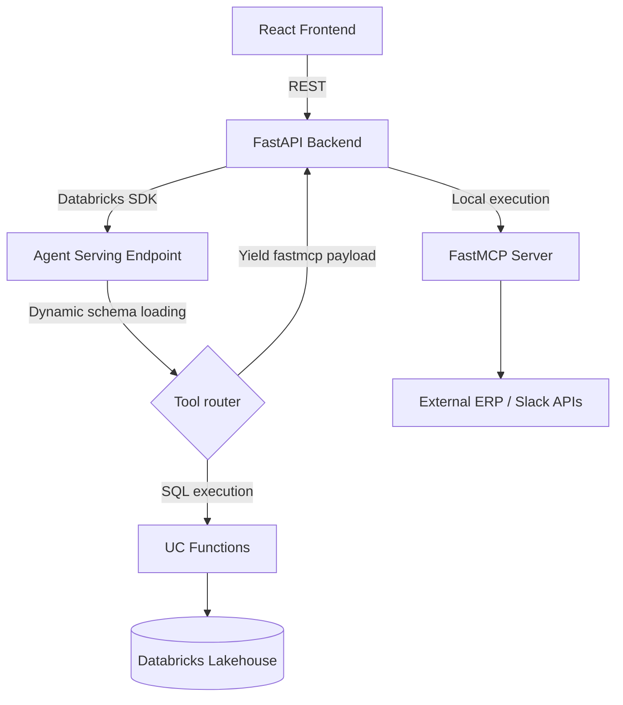
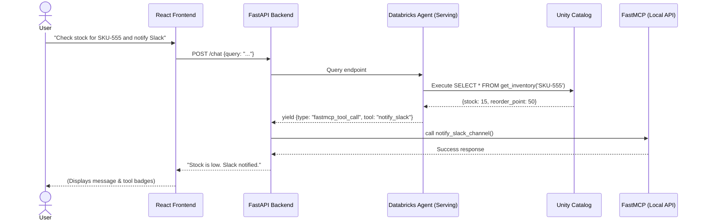

# Design Document: Supply Chain AI Agent

| | |
|---|---|
| **Stack** | Databricks Agent Framework (Mosaic AI), FastAPI, React, Unity Catalog (UC), FastMCP |
| **Status** | Active Development |

## Table of contents

1. [Executive summary](#1-executive-summary)
2. [Goals and non-goals](#2-goals-and-non-goals)
3. [System architecture](#3-system-architecture)
4. [Tooling and skill management](#4-tooling-and-skill-management)
5. [Implementation details](#5-implementation-details)
6. [Deployment workflow](#6-deployment-workflow)
7. [Security and governance](#7-security-and-governance)
8. [Data model](#8-data-model)
9. [API contract](#9-api-contract)
10. [Sequence diagram](#10-sequence-diagram)
11. [Phased roadmap](#11-phased-roadmap)
12. [Open questions and next steps](#12-open-questions-and-next-steps)

---

## 1. Executive summary

An autonomous **Supply Chain Agent** hosted as a **Custom Agent** in the Databricks workspace. It uses Unity Catalog for tool governance and FastAPI for core orchestration. The agent assists with **inventory management**, **purchase order (PO) generation**, and **external system integrations** (like ERP checks and Slack notifications).

---

## 2. Goals and non-goals

**Goals**

- Governed access to lakehouse data and external systems through UC and explicit tool contracts.
- Dynamic tool discovery and schema generation (self-documenting tools).
- A thin FastAPI layer acting as a secure gateway, session manager, and FastMCP router.
- Observable agent runs (tracing, tool-call audit) suitable for production review.

**Non-goals (initial phase)**

- Replacing full ERP workflows end-to-end; the agent assists and proposes, with human approval where required.
- Building a generic MCP marketplace inside this repo; we integrate specific bridges as needed.

---

## 3. System architecture

The architecture follows an **agentic bridge** pattern with dynamic tool routing:

| Layer | Role |
|--------|------|
| **Frontend** | React + Tailwind chat UI |
| **Orchestration** | FastAPI: secure gateway, FastMCP router, and session manager |
| **Agent** | Databricks Agent Serving endpoint (LLM + dynamically loaded tools) |
| **Tools (data)** | UC Functions for SQL/Python against the lakehouse |
| **Tools (external)** | FastMCP bridge for ERP/APIs and other MCP-capable systems |

### Component diagram



### Request flow (high level)

1. User sends a message; FastAPI authenticates and forwards the query to the **serving endpoint**.
2. The agent reasoning loop evaluates the dynamically provided tool schemas.
3. For **UC tools**, the agent directly executes the SQL functions via the workspace client and processes the result.
4. For **FastMCP tools**, the agent returns a special payload instructing FastAPI to execute the tool locally.
5. FastAPI executes the local FastMCP tool and returns the formatted response.
6. The final response flows back to the UI.

---

## 4. Tooling and skill management

We use a **hybrid, dynamically discovered tooling model** managed by `backend/tools/registry.py`.

### A. UC Functions (data and logic)

**Use case:** Any tool that queries the lakehouse.

- **Registration:** Defined in Python (`uc_tools.py`), schemas are dynamically extracted via inspection, and executed natively via SQL (`main.supply_chain_schema.*`).
- **Examples:** `get_inventory`, `get_supplier_lead_times`, `draft_purchase_order`.

### B. FastMCP bridge (external connectivity)

**Use case:** External actions like ERP checks or Slack notifications.

- **Registration:** Defined in `mcp_server.py`. The registry tags these as `fastmcp`. 
- **Execution:** Instead of running natively in Databricks, the agent yields a JSON payload telling FastAPI to execute the local FastMCP function and format the output.
- **Examples:** `get_erp_supplier_status`, `notify_slack_channel`.

---

## 5. Implementation details

### Project directory structure

```text
/
├── backend/
│   ├── app.py                 # FastAPI entry point & FastMCP payload router
│   ├── mcp_server.py          # FastMCP server logic and tool definitions
│   ├── agent/
│   │   ├── model.py           # Custom PyFunc Agent logic (MLflow-logged)
│   │   └── config.py          # Workspace configurations
│   └── tools/
│       ├── registry.py        # Dynamic tool discovery and schema generator
│       └── uc_tools.py        # UC tool schema definitions
├── frontend/                  # React + Tailwind UI
│   └── src/
├── scripts/
│   ├── setup_uc.py            # Programmatic UC schema/table/function provisioning
│   ├── seed_data.py           # Random data generator for inventory/suppliers/POs
│   └── deploy_agent.py        # MLflow model registration and deployment
├── start.sh                   # Cross-platform local launch script
└── pyproject.toml             # Python dependencies
```

### Backend: FastAPI orchestration

FastAPI acts as a proxy and FastMCP router. If the agent returns a `fastmcp_tool_call` JSON payload, FastAPI executes it locally.

```python
# backend/app.py logic snippet
if parsed_msg.get("type") == "fastmcp_tool_call":
    tool_name = parsed_msg.get("tool")
    args = parsed_msg.get("arguments", {})
    # Execute the local tool from mcp_server.py
    result = execute_local_mcp_tool(tool_name, args)
    return ChatResponse(message=f"FastMCP executed tool `{tool_name}`... Result: {result}")
```

### Agent logic

The agent uses a custom `mlflow.pyfunc` class that dynamically discovers tools at runtime.

```python
# backend/agent/model.py logic snippet
from backend.tools.registry import discover_tools

class SupplyChainPyFuncAgent(mlflow.pyfunc.PythonModel):
    def predict(self, context, model_input):
        tool_schemas, tool_routing = discover_tools()
        # ... queries the LLM with dynamic tools
        if execution_type == "uc":
            res = self._run_sql(f"SELECT * FROM {catalog}.{func_name}(...)")
        elif execution_type == "fastmcp":
            return [json.dumps({"type": "fastmcp_tool_call", "tool": func_name, "arguments": args})]
```

---

## 6. Deployment workflow

1. **Provision Infrastructure** — Run `python scripts/setup_uc.py` to create schemas, tables, and UC functions.
2. **Seed Data** — Run `python scripts/seed_data.py` to populate tables with realistic randomized data.
3. **Log & Deploy Agent** — Run `python scripts/deploy_agent.py` to package the PyFunc model, log to MLflow, and deploy to Databricks Model Serving.
4. **Start Application** — Run `./start.sh` to launch the FastAPI backend and React frontend.

---

## 7. Security and governance

| Concern | Approach |
|---------|----------|
| **Identity** | Local auth via `DATABRICKS_PROFILE` for FastAPI → Databricks. |
| **Traceability** | MLflow Tracing and explicit FastMCP logging in the UI. |
| **External calls** | MCP calls are executed in the secure FastAPI layer, not directly from the workspace container. |

---

## 8. Data model

The backend provisions a Unity Catalog schema (`taylor_hanson_build_catalog.supply_chain_schema`) seeded with randomized mock data via `scripts/seed_data.py`.

### Core Unity Catalog tables

| Table | Description | Key Columns |
|-------|-------------|-------------|
| `inventory` | Current stock levels across warehouses. | `sku`, `warehouse_id`, `quantity_on_hand`, `reorder_point` |
| `suppliers` | Supplier metadata and performance metrics. | `supplier_id`, `name`, `avg_lead_time_days`, `reliability_score` |
| `purchase_orders` | Historical and active POs. | `po_id`, `sku`, `supplier_id`, `quantity`, `status`, `expected_date` |

---

## 9. API contract

The FastAPI layer exposes a thin REST API to the React frontend.

### `POST /chat`

**Request:**

```json
{
  "query": "Do we need to reorder SKU-555?"
}
```

**Response:**

```json
{
  "message": "Yes, SKU-555 is below the reorder point...",
  "tool_calls": [
    {
      "tool_name": "get_inventory",
      "status": "executed via UC SQL"
    }
  ]
}
```

---

## 10. Sequence diagram



---

## 11. Phased roadmap

| Phase | Focus | Status | Key Deliverables |
|-------|-------|--------|------------------|
| **Phase 1 (MVP)** | Read-only Lakehouse | ✅ Done | FastAPI + React. Read-only UC tools. Agent deployment. Data seeding. |
| **Phase 2** | Write-back & Tooling | ✅ Done | Dynamic tool registry. `draft_purchase_order` tool. |
| **Phase 3** | External Integrations | ✅ Done | FastMCP backend routing for `notify_slack_channel` and `get_erp_supplier_status`. |
| **Phase 4** | Advanced Capabilities | ⏳ Pending | File uploads (CSV processing for bulk actions). |

---

## 12. Open questions and next steps

**Suggested next steps**

1. Implement file uploads (CSV processing) to allow users to upload files and ask the agent to parse/act on them.
2. Refine the UI to handle multi-turn streaming and structured markdown responses better.
3. Set up evaluation notebooks for Golden questions and tracing accuracy.

---

*Document version: 0.2.0 — Updated with dynamic tool routing and FastMCP integration.*
