# Design Document: EDH Agent

| | |
|---|---|
| **Stack** | Databricks Apps, FastAPI, React, LangGraph, Unity Catalog (UC) |
| **Status** | Active Development |

## Table of contents

1. [Executive summary](#1-executive-summary)
2. [Goals and non-goals](#2-goals-and-non-goals)
3. [System architecture](#3-system-architecture)
4. [Tooling and skill management](#4-tooling-and-skill-management)
5. [Streaming and the reasoning ("Thoughts") panel](#5-streaming-and-the-reasoning-thoughts-panel)
6. [In-app architecture presentation](#6-in-app-architecture-presentation)
7. [Implementation details](#7-implementation-details)
8. [Configuration](#8-configuration)
9. [Deployment workflow](#9-deployment-workflow)
10. [Evaluation, feedback and observability](#10-evaluation-feedback-and-observability)
11. [Security and governance](#11-security-and-governance)
12. [API contract](#12-api-contract)
13. [Phased roadmap](#13-phased-roadmap)

---

## 1. Executive summary

The **EDH Agent** is an enterprise data assistant for **Qualcomm**, hosted natively as a **Databricks App**. It uses **LangGraph** for robust tool orchestration and LLM interaction, running within a FastAPI backend that also serves a React-based UI. The agent discovers its capabilities dynamically from the user's Unity Catalog permissions — SQL over the Lakehouse, Genie analytics, Unity Catalog functions, and instructional "skills" — all governed per-user via On-Behalf-Of (OBO) auth.

By leveraging Databricks Apps, we achieve rapid deployment, full-stack hosting on a single secure URL, and direct integration with Databricks Foundation Models and Unity Catalog.

---

## 2. Goals and non-goals

**Goals**

- Full-stack execution within a unified Databricks App environment.
- Serverless orchestration using LangGraph directly in the FastAPI process.
- Dynamic tool discovery (Unity Catalog functions + local Python tools) and schema generation.
- Real-time streaming UI (Server-Sent Events) with a visible, collapsible reasoning ("Thoughts") panel.
- Integration with Databricks Genie spaces for dynamic data analytics.
- A closed feedback loop with MLflow tracing and an LLM-as-judge evaluation job.

**Non-goals (initial phase)**

- Replacing full ERP workflows end-to-end; the agent assists and proposes, with human approval where required.
- Building a complex multi-agent system (we are starting with a single ReAct agent graph).
- Using MLflow Model Serving endpoints for the *app* (we migrated to Databricks Apps for speed and simplicity; serving endpoints are still used as the LLM backend).

---

## 3. System architecture

The architecture leverages Databricks Apps as the core hosting and execution environment:

| Layer | Role |
|--------|------|
| **Frontend** | React + Tailwind chat UI (built by Vite, served by FastAPI in production) |
| **Backend** | FastAPI server handling HTTP endpoints and SSE streaming |
| **Agent** | LangGraph `create_agent` using `ChatOpenAI` against a Databricks serving endpoint |
| **Tools** | Unity Catalog functions + LangChain `@tool` wrapped Python functions executing inside the App container |
| **LLM** | Configurable via `LLM_MODEL_NAME` (default `databricks-claude-sonnet-4-6`). Production uses the A/B endpoint `supply_chain_agent_endpoint` (Claude / Llama traffic split). |

### Component diagram

```mermaid
graph TD
    User((User)) <-->|Browser| A[Databricks App UI]
    A <-->|REST/SSE /chat| B[FastAPI Backend]

    subgraph "Databricks App Container"
        B <-->|Stream| C[LangGraph Agent]
        C <-->|Thought/Action| D{Tool Registry}
        D -->|UC Functions| E[Unity Catalog Tools]
        D -->|query_lakehouse / SQL| H2[SQL Warehouse]
        D -->|Genie Query| F[Genie Integration]
        D -->|API Request| G[External API Tools]
    end

    C <-->|llm/v1/chat| K[Serving Endpoint / FM API]
    E --> H[(Databricks Lakehouse)]
    F --> I[Databricks Genie Spaces]
    G --> J[External ERP / Slack APIs]
```



### Request flow (high level)

1. User sends a message via the UI.
2. The UI sends a POST request to FastAPI `/chat` with the session id, query, and selected tools/skills.
3. FastAPI loads the `LangGraph` agent (`load_context`) and passes the conversation history.
4. `LangGraph` orchestrates the Thought → Action → Observation loop, streaming events back via Server-Sent Events (SSE).
5. If the LLM requests a tool, `LangGraph` executes the mapped UC function or Python tool. Tool failures are caught and returned to the model as recoverable error messages (see [§5](#5-streaming-and-the-reasoning-thoughts-panel)).
6. The frontend renders streamed Markdown answers plus a collapsible reasoning panel and tool badges in real-time.

---

## 4. Tooling and skill management

Tools and skills are resolved at agent initialization by `backend/tools/registry.py`.

### A. Skills (Cognitive SOPs)

**Use case:** Providing the agent with standard operating procedures on how to analyze data, what policies to follow, or how to chain tools together for a specific business process.

- **Storage:** Skills are `.md` files (with a YAML frontmatter `description`) stored in a **Unity Catalog Volume**, configured by `SKILLS_VOLUME_PATH` (e.g. `/Volumes/<catalog>/<schema>/skills`).
- **Discovery:** `discover_skills()` lists `.md` files across volumes named `skills` and injects their descriptions into the system prompt.
- **Execution:** The agent uses the `read_skill` tool to read a skill's full instructions on demand, then executes them with the native tools.

### B. Tools

The agent binds three kinds of tools (in this priority order; names are de-duplicated so the first binding wins):

- **Databricks managed MCP tools (SQL + Genie):** `registry.py` connects to the workspace's **managed MCP servers** and binds them first:
  - `query_lakehouse` → the SQL MCP server (`/api/2.0/mcp/sql`, `execute_sql_read_only` + `poll_sql_result`).
  - `ask_genie` / `list_genies` → the Genie MCP server (`/api/2.0/mcp/genie/{space_id}`, `query_space_*` + `poll_response_*`).
  These call under the user's **OBO token** for governance parity. `backend/tools/managed_mcp.py` holds a small stateless JSON-RPC client (`requests`-only) plus the tool wrappers. Genie and long SQL statements are asynchronous (ask/execute → poll), and the **poll loop is handled inside the tool**, so the agent makes one blocking call and gets the final answer instead of dozens of poll round-trips. (See "Genie long-running flow" below.)
- **Unity Catalog functions:** `registry.py` queries `system.information_schema.routines` for functions in the configured `CATALOG_SCHEMA` and loads them with `databricks-langchain`'s `UCFunctionToolkit`. Results are cached in `tools_skills_cache.db`. Any UC function whose name collides with a managed-MCP tool is skipped.
- **Core local Python tools (always bound):** `read_skill` lives in `backend/tools/mcp/` and is **always** bound (the system prompt depends on it, and it is not a UC function). The legacy local SQL/Genie tools (`query_lakehouse.py`, `ask_genie.py`, `list_genies.py`) remain as a latent fallback that only loads if both managed MCP and UC discovery are unavailable.

#### Genie long-running flow

The Genie MCP server is a two-tool async pattern: `query_space_{space_id}(query)` starts a turn and returns `conversationId` + `messageId` (`status="ASKING_AI"`), then `poll_response_{space_id}(conversation_id, message_id)` is called repeatedly until `status="COMPLETED"` (turns typically take ~1-5 minutes). `ask_genie` runs this loop internally (≈4s between polls, ~6 min cap) and returns the natural-language answer plus any SQL result table. The workspace-wide `genie_ask` tool is equivalent but currently hidden by a Databricks bug, so we target the per-space path which is unaffected.

---

## 5. Streaming and the reasoning ("Thoughts") panel

The agent streams responses over SSE and surfaces its intermediate reasoning to the UI.

- **Adaptive streaming:** On load, the agent checks whether the serving endpoint has **AI Gateway output guardrails** (`_has_output_guardrails`, cached per process). Guardrails buffer the full response and cannot stream token-by-token, so:
  - **No guardrails →** token-by-token streaming (`_predict_streaming`).
  - **Guardrails present →** a single blocking invocation that still surfaces reasoning/tool steps (`_predict_blocking`).
- **Reasoning panel:** Intermediate steps (extended-thinking content, tool announcements like `Using query_lakehouse`) are emitted as `reasoning` events and rendered in a collapsible, lighter-gray **Thoughts** disclosure in the UI.
- **Reclassification:** Text a model "preamble" emits before calling a tool is optimistically streamed as the answer, then moved into Thoughts once the turn is identified as a tool step. The boundary is detected reliably via the following `ToolMessage`, `finish_reason == "tool_calls"`, or tool-call chunks (`reclassify` event).
- **Scaffolding sanitizer:** Some endpoints make the model narrate tool use as inline text (`<tool_call>…</tool_call>`, `<tool_response>…</tool_response>`, `<read_skill_result>…</read_skill_result>`). An incremental sanitizer strips this from the answer (holding back partial tags across chunks) and surfaces tool names in Thoughts. A final `final` event replaces the streamed content with the fully cleaned answer as a safety net.
- **Tool-error resilience:** A `wrap_tool_call` middleware (`_build_tool_error_middleware`) converts any tool exception (bad arguments, permissions, warehouse errors) into an error `ToolMessage` so a single failing tool call cannot crash the whole stream — the model sees the error and recovers.

---

## 6. In-app architecture presentation

`src/ArchitecturePresentation.tsx` is a slide-based presentation rendered inside the app (opened from the architecture button in the UI). It walks through the "North Star" agent architecture for demos and onboarding. It is a self-contained React component and does not call the backend.

---

## 7. Implementation details

### Project directory structure

```text
/
├── backend/                   # Python backend (FastAPI + LangGraph)
│   ├── app.py                 # FastAPI server: endpoints + SSE streaming + MLflow tracing
│   ├── agent/
│   │   ├── model.py           # LangGraph agent, streaming/blocking logic, sanitizer, middleware
│   │   ├── config.py          # Environment-driven configuration
│   │   └── prompt.md          # Core agent system prompt
│   └── tools/
│       ├── managed_mcp.py     # Databricks managed MCP client + SQL/Genie tool wrappers (OBO)
│       ├── mcp/               # Local Python tools (read_skill.py + legacy SQL/Genie fallbacks)
│       └── registry.py        # Dynamic tool/skill discovery (managed MCP + UC functions + local)
├── src/                       # React frontend
│   ├── App.tsx                # Chat UI, SSE handling, Thoughts panel, tool badges, custom instructions
│   ├── ToolsAndSkillsModal.tsx       # Tools/skills picker + user-level Custom Instructions box
│   └── ArchitecturePresentation.tsx  # In-app architecture slideshow
├── evals/
│   ├── run_llm_judge.py       # LLM-as-judge evaluation over inference-table traces
│   └── test_agent.py          # Agent tests
├── scripts/                   # One-time setup automation (see §9)
├── public/                    # Static frontend assets
├── databricks.yml             # Databricks Asset Bundle: App + LLM-judge job
├── deploy_app.sh              # Production deployment script
├── dev.sh                     # Local development script
├── vite.config.ts             # Vite dev server (port 5174) + API proxy to backend :8001
├── package.json               # Node.js dependencies
└── requirements.txt           # Python dependencies
```

---

## 8. Configuration

Configuration is environment-driven (`backend/agent/config.py`). The shipped code keeps no workspace-specific defaults for the catalog/schema/warehouse so the agent stays generic; in production they are injected by the Databricks App via `databricks.yml`, and for local dev `dev.sh` exports overridable defaults (or copy `.env.example`).

| Variable | Purpose | Default |
|----------|---------|---------|
| `CATALOG_SCHEMA` | Catalog and schema for UC tools/functions | _(unset; set via env / `dev.sh` / `databricks.yml`)_ |
| `LLM_MODEL_NAME` | Serving endpoint the agent calls | `databricks-claude-sonnet-4-6` |
| `MAX_TOKENS` | Max output tokens (applied to the LLM) | `16384` |
| `MAX_ITERATIONS` | Max agent loop iterations (maps to LangGraph `recursion_limit` = `2*N+1`) | `10` |
| `SKILLS_VOLUME_PATH` | UC Volume holding skill `.md` files | _(unset; falls back to dynamic `skills`-volume discovery)_ |
| `DATABRICKS_WAREHOUSE_ID` | SQL warehouse used for UC discovery | _(unset; set via env / `dev.sh` / `databricks.yml`)_ |
| `DATABRICKS_PROFILE` | Local auth profile (local dev only) | `myenv` |
| `MLFLOW_EXPERIMENT_NAME` | MLflow experiment for traces | `/Shared/supply_chain_agent` |

---

## 9. Deployment workflow

The project runs natively as a Databricks App, deployed via Databricks Asset Bundles (`databricks.yml`).

### First-time setup

One-time platform configuration is automated by the scripts in `scripts/` and tracked in [`TODO.md`](./TODO.md):

- `create_ab_test_route.py` — create the `supply_chain_agent_endpoint` A/B route.
- `register_uc_tools.py` / `register_uc_tools.sql` — register the UC functions the agent uses.
- `create_volumes.py` — create the skills Volume.
- `enable_inference_tables.py` — enable payload logging for the feedback loop.
- `grant_sp_permissions.py` — grant the App service principal the needed permissions.

### Production deployment

Builds the React frontend, syncs code to the workspace, and creates/updates the App (and the LLM-judge job):

```bash
./deploy_app.sh
```

### Local development

Runs the FastAPI backend and the Vite frontend locally, proxying API requests from the frontend (port `5174`) to the backend (port `8001`):

```bash
./dev.sh
```

This requires a valid `DATABRICKS_PROFILE` in your environment.

---

## 10. Evaluation, feedback and observability

- **Tracing:** `app.py` configures MLflow tracing (`mlflow.langchain.autolog()`) and an experiment (`MLFLOW_EXPERIMENT_NAME`). Each `/chat` response returns a `trace_id`.
- **User feedback:** Thumbs up/down in the UI POST to `/feedback`, which writes ratings (keyed by `trace_id`) to a Delta table (`agent_feedback`).
- **Inference tables:** Production traffic/payloads are captured to `agent_payload_logs` (via AI Gateway payload logging).
- **LLM judge:** `evals/run_llm_judge.py` (scheduled as the `llm_judge_evaluator` job in `databricks.yml`) reads the inference table and writes evaluation scores to `agent_eval_scores`.

---

## 11. Security and governance

| Concern | Approach |
|---------|----------|
| **Identity** | Locally uses `.databrickscfg` (`DATABRICKS_PROFILE`). In production, the Databricks App runs under an injected Service Principal identity. |
| **Data Access** | The App's Service Principal must be granted permissions on Unity Catalog schemas, the SQL warehouse, the serving endpoint (`CAN_QUERY`), and Genie spaces to operate. |
| **Tool isolation** | Tool exceptions are contained by middleware and never crash the request; errors are returned to the model rather than surfaced as raw stack traces. |

---

## 12. API contract

### `POST /chat`

**Request:**

```json
{
  "session_id": "12345",
  "query": "What is our average lead time?",
  "selected_tools": ["query_lakehouse"],
  "selected_skills": ["safety_stock_policy"],
  "user_prompt": "Always answer concisely. Default to the prod_analytics catalog."
}
```

`selected_tools` and `selected_skills` are optional; when omitted, all discovered tools/skills are available. `user_prompt` is an optional user-level instruction set from the **Custom Instructions** box in the Tools & Skills panel; it is appended to the system prompt (after the base prompt and skills) so it takes precedence over the defaults, but cannot override the safety/tool-usage rules.

**Response:** Streams Server-Sent Events (SSE). Event `type` values:

| `type` | Meaning |
|--------|---------|
| `chunk` | A token-by-token delta of the visible answer |
| `reasoning` | A delta for the collapsible "Thoughts" panel |
| `reclassify` | Move already-streamed text from the answer into Thoughts |
| `final` | Authoritative, fully-cleaned answer (replaces streamed content) |
| `tool_calls` | The list of tools that executed this turn |
| `trace_id` | MLflow trace id for the response (used by feedback) |
| `error` | A streaming error message |

```text
data: {"type": "reasoning", "content": "Using query_lakehouse\n"}
data: {"type": "chunk", "content": "Your average "}
data: {"type": "chunk", "content": "lead time is 12 days."}
data: {"type": "tool_calls", "content": [{"tool_name": "query_lakehouse"}]}
data: {"type": "final", "content": "Your average lead time is 12 days."}
data: {"type": "trace_id", "content": "tr-..."}
data: [DONE]
```

### Other endpoints

| Endpoint | Purpose |
|----------|---------|
| `POST /clear_chat` | Clear in-memory conversation history for a session |
| `POST /feedback` | Submit a thumbs up/down rating (by `trace_id`) |
| `GET /tools-and-skills` | List the tools and skills available to the user |
| `POST /upload` | Upload a file (CSV/XLSX) for processing |

---

## 13. Phased roadmap

| Phase | Focus | Status | Key Deliverables |
|-------|-------|--------|------------------|
| **Phase 1** | MVP & Read-only Lakehouse | ✅ Done | FastAPI + React. Read-only UC tools. |
| **Phase 2** | Write-back & Tooling | ✅ Done | Dynamic tool registry. `draft_purchase_order` tool. |
| **Phase 3** | External Integrations | ✅ Done | Tools for `notify_slack_channel` and `get_erp_supplier_status`. |
| **Phase 4** | Advanced Capabilities | ✅ Done | File uploads (CSV/XLSX processing), `manage_safety_stock` tool. |
| **Phase 5** | Cognitive SOPs | ✅ Done | Dynamic Skill framework (UC Volume) for markdown-based agent procedures. |
| **Phase 6** | Framework Alignment | ✅ Done | Refactor to **Databricks Apps**; dynamic Genie discovery; A/B serving endpoint. |
| **Phase 7** | Streaming UX & Resilience | ✅ Done | SSE streaming with the "Thoughts" panel, guardrail-aware fallback, scaffolding sanitizer, and tool-error middleware. |
| **Phase 8** | Evaluation & Feedback Loop | ✅ Done | MLflow tracing, `/feedback` ratings, inference tables, and the LLM-judge job. |

---

*Document version: 1.1.0 — Updated for streaming/Thoughts UX, UC tool discovery, evaluation loop, and in-app architecture presentation.*
