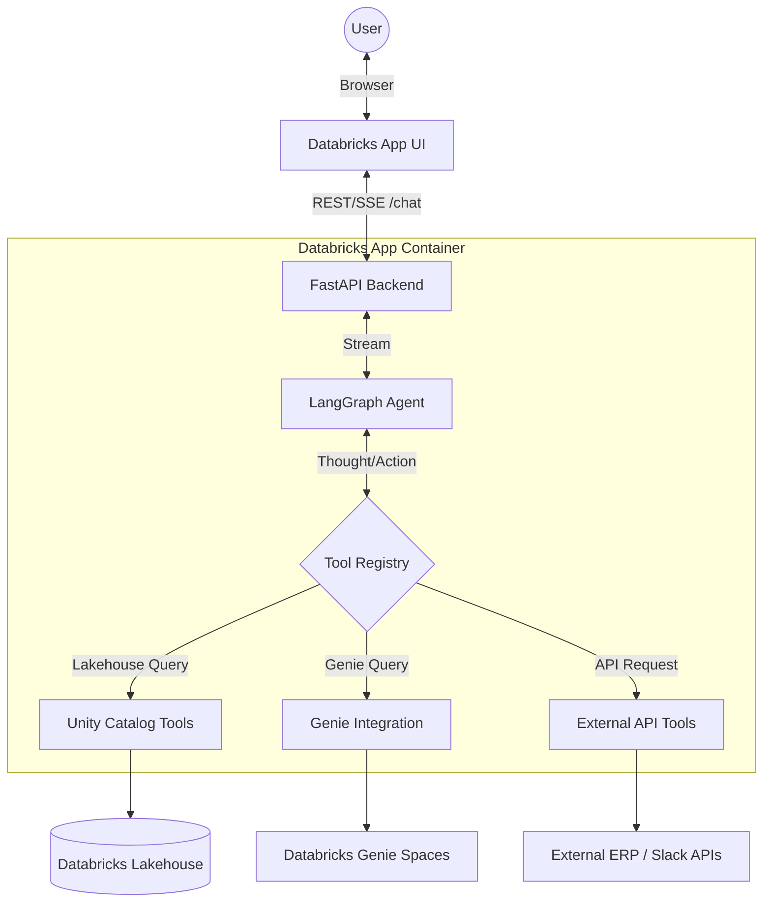

# Design Document: Supply Chain AI Agent

| | |
|---|---|
| **Stack** | Databricks Apps, FastAPI, React, LangGraph, Unity Catalog (UC) |
| **Status** | Active Development |

## Table of contents

1. [Executive summary](#1-executive-summary)
2. [Goals and non-goals](#2-goals-and-non-goals)
3. [System architecture](#3-system-architecture)
4. [Tooling and skill management](#4-tooling-and-skill-management)
5. [Implementation details](#5-implementation-details)
6. [Deployment workflow](#6-deployment-workflow)
7. [Security and governance](#7-security-and-governance)
8. [Data model](#8-data-model)
9. [API contract](#9-api-contract)
10. [Sequence diagram](#10-sequence-diagram)
11. [Phased roadmap](#11-phased-roadmap)

---

## 1. Executive summary

An autonomous **Supply Chain Agent** hosted natively as a **Databricks App**. It uses **LangGraph** for robust tool orchestration and LLM interaction, running within a FastAPI backend that also serves a React-based UI. The agent assists with **inventory management**, **purchase order (PO) generation**, **Genie analytics**, and **external system integrations** (like ERP checks and Slack notifications). 

By leveraging Databricks Apps, we achieve rapid deployment, full-stack hosting on a single secure URL, and direct integration with Databricks Foundation Models and Unity Catalog.

---

## 2. Goals and non-goals

**Goals**

- Full-stack execution within a unified Databricks App environment.
- Serverless orchestration using LangGraph directly in the FastAPI process.
- Dynamic tool discovery and schema generation.
- Real-time streaming UI (Server-Sent Events) for responsive user experience.
- Integration with Databricks Genie spaces for dynamic data analytics.

**Non-goals (initial phase)**

- Replacing full ERP workflows end-to-end; the agent assists and proposes, with human approval where required.
- Building a complex multi-agent system (we are starting with a single ReAct agent graph).
- Using MLflow Model Serving endpoints (we migrated to Databricks Apps for speed and simplicity).

---

## 3. System architecture

The architecture leverages Databricks Apps as the core hosting and execution environment:

| Layer | Role |
|--------|------|
| **Frontend** | React + Tailwind chat UI (compiled and served by FastAPI) |
| **Backend** | FastAPI server handling HTTP endpoints and SSE streaming |
| **Agent** | LangGraph `create_agent` using `ChatOpenAI` against Foundation Models |
| **Tools** | LangChain `@tool` wrapped Python functions executing inside the App container |

### Component diagram



### Request flow (high level)

1. User sends a message via the UI.
2. The UI sends a POST request to FastAPI `/chat`.
3. FastAPI instantiates the `LangGraph` agent and passes the conversation history.
4. `LangGraph` orchestrates the Thought -> Action -> Observation loop, streaming chunks back via Server-Sent Events (SSE).
5. If the LLM requests a tool (e.g., `list_genies`), `LangGraph` executes the mapped Python function directly in the App process.
6. The frontend renders the streamed Markdown and tools in real-time.

---

## 4. Tooling and skill management

We use a **dynamic discovery model** managed by `backend/tools/registry.py`. We also support a **Skills Framework** for cognitive SOPs.

### A. Skills (Cognitive SOPs)

**Use case:** Providing the agent with standard operating procedures on how to analyze data, what policies to follow, or how to chain tools together for a specific business process.

- **Registration:** Add a `.md` file to `backend/skills/` with a YAML frontmatter `description`.
- **Execution:** The agent reads the descriptions injected into its system prompt and uses the native tools to fulfill the workflows.

### B. Python Tools (LangChain)

**Use case:** Any action the agent needs to take, whether it's querying the lakehouse, asking Genie a question, or hitting an external ERP API.

- **Registration:** Defined as individual `.py` files in `backend/tools/mcp/`. 
- **Execution:** During initialization, `registry.py` discovers these Python functions and wraps them using LangChain's `tool` primitive. They are injected into the LangGraph state machine.

---

## 5. Implementation details

### Project directory structure

```text
/
├── backend/                   # Python backend (FastAPI + LangGraph)
│   ├── app.py                 # FastAPI backend server
│   ├── agent/
│   │   ├── model.py           # LangGraph agent definition
│   │   ├── config.py          # Workspace configurations
│   │   └── prompt.md          # Core agent personality
│   ├── skills/                # Markdown SOPs
│   └── tools/
│       ├── mcp/               # Individual Python tools (e.g. ask_genie.py)
│       └── registry.py        # Dynamic tool/skill discovery
├── src/                       # React frontend code
├── public/                    # Static frontend assets
├── package.json               # Node.js dependencies
├── app.yaml                   # Databricks Apps configuration
├── deploy_app.sh              # Production deployment script
├── dev.sh                     # Local development script
└── requirements.txt           # Python dependencies
```

---

## 6. Deployment workflow

The project runs natively as a Databricks App. 

### Production Deployment
Run the deployment script, which builds the React frontend, syncs the code to your workspace, and creates/updates the Databricks App:
```bash
./deploy_app.sh
```

### Local Development
For fast iteration, you can run the FastAPI backend and Vite frontend locally. It automatically proxies API requests from the frontend to the backend.
```bash
./dev.sh
```
This requires a valid `DATABRICKS_PROFILE` in your environment.

---

## 7. Security and governance

| Concern | Approach |
|---------|----------|
| **Identity** | Locally uses `.databrickscfg` (`DATABRICKS_PROFILE`). In production, the Databricks App automatically runs under an injected Service Principal identity. |
| **Data Access** | The App's Service Principal must be granted necessary permissions on Unity Catalog schemas and Genie spaces to operate successfully. |

---

## 8. API contract

### `POST /chat`

**Request:**

```json
{
  "session_id": "12345",
  "query": "What is our average lead time?"
}
```

**Response:** Streams Server-Sent Events (SSE)
```text
data: {"type": "chunk", "content": "Let me "}
data: {"type": "tool_calls", "content": [{"tool_name": "list_genies", ...}]}
data: {"type": "chunk", "content": "check that!"}
data: [DONE]
```

---

## 9. Phased roadmap

| Phase | Focus | Status | Key Deliverables |
|-------|-------|--------|------------------|
| **Phase 1** | MVP & Read-only Lakehouse | ✅ Done | FastAPI + React. Read-only UC tools. |
| **Phase 2** | Write-back & Tooling | ✅ Done | Dynamic tool registry. `draft_purchase_order` tool. |
| **Phase 3** | External Integrations | ✅ Done | Tools for `notify_slack_channel` and `get_erp_supplier_status`. |
| **Phase 4** | Advanced Capabilities | ✅ Done | File uploads (CSV/XLSX processing), `manage_safety_stock` tool. |
| **Phase 5** | Cognitive SOPs | ✅ Done | Dynamic Skill framework (`backend/skills/`) for markdown-based agent procedures. |
| **Phase 6** | Framework Alignment | ✅ Done | Full refactor to **Databricks Apps**, dropping Model Serving for speed and unified hosting. Added dynamic Genie discovery. |

---

*Document version: 1.0.0 — Refactored to Databricks Apps Architecture.*