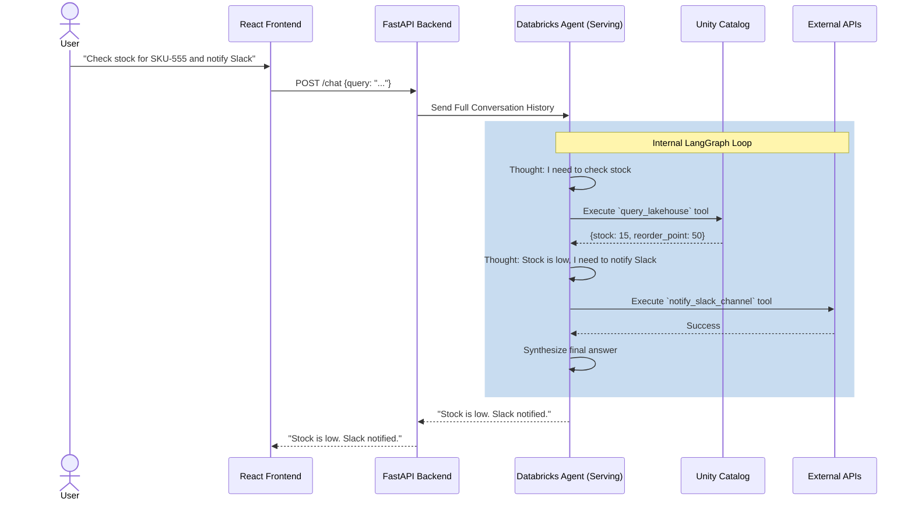

# Design Document: Supply Chain AI Agent

| | |
|---|---|
| **Stack** | Databricks AI Framework (`ResponsesAgent`, `LangGraph`), FastAPI, React, Unity Catalog (UC) |
| **Status** | Active Development |

## Table of contents

1. [Executive summary](#1-executive-summary)
2. [Goals and non-goals](#2-goals-and-non-goals)
3. [System architecture](#3-system-architecture)
4. [Tooling and skill management](#4-tooling-and-skill-management)
5. [Implementation details](#5-implementation-details)
6. [Deployment workflow](#6-deployment-workflow)
7. [Security and governance](#7-security-and-governance)
8. [Data model](#8-data-model)
9. [API contract](#9-api-contract)
10. [Sequence diagram](#10-sequence-diagram)
11. [Phased roadmap](#11-phased-roadmap)
12. [Open questions and next steps](#12-open-questions-and-next-steps)

---

## 1. Executive summary

An autonomous **Supply Chain Agent** hosted as a **Custom Agent** in the Databricks workspace. It uses the Databricks AI Framework (specifically the `ResponsesAgent` wrapper over `LangGraph`) for robust tool orchestration and LLM interaction. The agent assists with **inventory management**, **purchase order (PO) generation**, and **external system integrations** (like ERP checks and Slack notifications).

---

## 2. Goals and non-goals

**Goals**

- Deep integration with the Databricks AI Framework (`mlflow.pyfunc.ResponsesAgent`).
- Serverless execution of tools directly within the Model Serving endpoint container using LangChain.
- Dynamic tool discovery and schema generation.
- Observable agent runs (tracing, tool-call audit) suitable for production review via AI Gateway Inference Tables.
- A thin FastAPI layer acting purely as a secure gateway to the deployed agent.

**Non-goals (initial phase)**

- Replacing full ERP workflows end-to-end; the agent assists and proposes, with human approval where required.
- Building a complex multi-agent system (we are starting with a single ReAct agent graph).

---

## 3. System architecture

The architecture leverages Databricks Model Serving as the core brain and execution environment:

| Layer | Role |
|--------|------|
| **Frontend** | React + Tailwind chat UI |
| **Orchestration** | FastAPI: secure gateway and session proxy |
| **Agent** | Databricks Agent Serving endpoint (`ResponsesAgent` + `LangGraph` + `ChatOpenAI` against Foundation Models) |
| **Tools** | LangChain `@tool` wrapped Python functions executing inside the Serving container |

### Component diagram

```mermaid
graph TD
    A[React Frontend] -->|REST /chat| B[FastAPI Proxy]
    B -->|Databricks SDK query()| C[Databricks Model Serving Endpoint]
    
    subgraph "ResponsesAgent Container"
        C -->|Initialize| D[LangGraph ReAct Agent]
        D <-->|Thought/Action Loop| E{Tool Router}
        E -->|Lakehouse Query| F[Unity Catalog Tools]
        E -->|API Request| G[External API Tools]
    end
    
    F --> H[(Databricks Lakehouse)]
    G --> I[External ERP / Slack APIs]
```

### Request flow (high level)

1. User sends a message via the UI.
2. FastAPI proxies the session history to the **Databricks Model Serving endpoint**.
3. Inside the endpoint, the `ResponsesAgent` passes the messages to `LangGraph`.
4. `LangGraph` orchestrates the Thought -> Action -> Observation loop.
5. If the LLM requests a tool, `LangGraph` executes the mapped Python function directly inside the serverless container.
6. Once a final answer is synthesized, the text is returned to FastAPI, which forwards it to the UI.

---

## 4. Tooling and skill management

We use a **dynamic discovery model** managed by `backend/tools/registry.py`. We also support a **Skills Framework** for cognitive SOPs.

### A. Skills (Cognitive SOPs)

**Use case:** Providing the agent with standard operating procedures on how to analyze data, what policies to follow, or how to chain tools together for a specific business process.

- **Registration:** Add a `.md` file to `backend/skills/` with a YAML frontmatter `description`.
- **Execution:** The agent reads the description injected into its system prompt and uses the native `read_skill` tool to retrieve the markdown instructions when relevant.

### B. Python Tools (LangChain)

**Use case:** Any action the agent needs to take, whether it's querying the lakehouse via the Databricks SDK, or hitting an external ERP API.

- **Registration:** Defined as individual `.py` files in `backend/tools/mcp/`. 
- **Execution:** During model deployment and initialization, `registry.py` discovers these Python functions and wraps them using LangChain's `tool` primitive. They are injected into the LangGraph state machine.

---

## 5. Implementation details

### Project directory structure

```text
/
├── backend/
│   ├── app.py                 # FastAPI proxy server
│   ├── agent/
│   │   ├── model.py           # ResponsesAgent & LangGraph wrapper logic
│   │   ├── config.py          # Workspace configurations
│   │   └── prompt.md          # Core agent personality and system instructions
│   ├── skills/                # Markdown SOPs (e.g. analyze_safety_stock.md)
│   └── tools/
│       ├── mcp/               # Individual Python tools (e.g. notify_slack.py)
│       └── registry.py        # Dynamic tool/skill discovery and LangChain wrapping
├── frontend/                  # React + Tailwind UI
│   └── src/
├── scripts/
│   └── deploy_agent.py        # MLflow model registration and deployment
├── deploy.sh                  # Core deployment script
└── requirements.txt           # Python dependencies
```

### Agent logic (`model.py`)

The agent uses the Databricks `ResponsesAgent` wrapper around a `LangGraph` prebuilt ReAct agent.

```python
from langgraph.prebuilt import create_react_agent
from backend.tools.registry import get_langchain_tools

class SupplyChainLangGraphAgent(mlflow.pyfunc.ResponsesAgent):
    def load_context(self, context):
        # Configure LLM to point to Foundation Models
        llm = ChatOpenAI(...)
        tools = get_langchain_tools()
        self.agent = create_react_agent(llm, tools, state_modifier=system_prompt)

    def predict(self, request):
        # LangGraph handles the entire multi-turn tool execution loop
        result = self.agent.invoke({"messages": formatted_msgs})
        return mlflow.types.responses.ResponsesAgentResponse(output=[...])
```

---

## 6. Deployment workflow

The project includes a generic deployment script (`deploy.sh`) that builds the environment and deploys the agent to Databricks Model Serving. It assumes you are deploying against an existing Unity Catalog and schema.

1. **Clone the repository**:
   ```bash
   git clone https://github.com/taylor-hanson_data/supply-chain-agent.git
   cd supply-chain-agent
   ```
2. **Configure Environment**: 
   Ensure your Databricks CLI is configured (`databricks configure`). By default, the deploy script uses a profile named `myenv`. 
3. **Deploy the Agent**:
   Run the deployment script, overriding the defaults to point to your real Unity Catalog environment:
   ```bash
   CATALOG_SCHEMA="my_production_catalog.my_schema" \
   AGENT_ENDPOINT_NAME="my_agent_endpoint" \
   DATABRICKS_PROFILE="default" \
   ./deploy.sh
   ```
4. **Start Application**: 
   Run `./start.sh` to launch the FastAPI backend and React frontend locally. (Note: Use `LOCAL_MODE=true ./start.sh` if you want to bypass the hosted endpoint and run the agent logic locally for faster development).

### Optional: Sandbox Data Setup
If you are deploying this in a fresh environment and want to generate mock tables and data for testing instead of using real data, you can run the setup scripts *before* deploying:
```bash
python -m venv .venv
source .venv/bin/activate
pip install -r requirements.txt
python scripts/setup_uc.py
python scripts/seed_data.py
```

---

## 7. Security and governance

| Concern | Approach |
|---------|----------|
| **Identity** | Local auth via `DATABRICKS_PROFILE` for FastAPI → Databricks. Inside Model Serving, tools execute using the Endpoint's configured Service Principal. |
| **Traceability** | `ResponsesAgent` natively integrates with MLflow Tracing and AI Gateway Inference Tables. |

---

## 8. Data model

### Core Unity Catalog tables

| Table | Description | Key Columns |
|-------|-------------|-------------|
| `inventory` | Current stock levels across warehouses. | `sku`, `warehouse_id`, `quantity_on_hand`, `reorder_point` |
| `suppliers` | Supplier metadata and performance metrics. | `supplier_id`, `name`, `avg_lead_time_days`, `reliability_score` |
| `purchase_orders` | Historical and active POs. | `po_id`, `sku`, `supplier_id`, `quantity`, `status`, `expected_date` |

---

## 9. API contract

The FastAPI layer exposes a thin REST API to the React frontend.

### `POST /chat`

**Request:**

```json
{
  "session_id": "12345",
  "query": "Do we need to reorder SKU-555?"
}
```

**Response:**

```json
{
  "message": "Yes, SKU-555 is below the reorder point...",
  "tool_calls": []
}
```
*(Note: Because the tool execution loop now happens entirely inside the Databricks Serving Endpoint, the frontend only receives the final synthesized text).*

---

## 10. Sequence diagram



---

## 11. Phased roadmap

| Phase | Focus | Status | Key Deliverables |
|-------|-------|--------|------------------|
| **Phase 1 (MVP)** | Read-only Lakehouse | ✅ Done | FastAPI + React. Read-only UC tools. Agent deployment. Data seeding. |
| **Phase 2** | Write-back & Tooling | ✅ Done | Dynamic tool registry. `draft_purchase_order` tool. |
| **Phase 3** | External Integrations | ✅ Done | Tools for `notify_slack_channel` and `get_erp_supplier_status`. |
| **Phase 4** | Advanced Capabilities | ✅ Done | File uploads (CSV/XLSX processing), `manage_safety_stock` tool. |
| **Phase 5** | Cognitive SOPs | ✅ Done | Dynamic Skill framework (`backend/skills/`) for markdown-based agent procedures. |
| **Phase 6** | Framework Alignment | ✅ Done | Refactored to native Databricks AI Framework (`ResponsesAgent` + `LangGraph`). |

---

## 12. Open questions and next steps

**Suggested next steps**

1. Set up Databricks Agent Evaluation notebooks to run Judges against the Inference Tables.
2. Add a dedicated Vector Search retriever tool mapped via `mlflow.models.set_retriever_schema` for semantic search.

---

*Document version: 0.4.0 — Refactored to Databricks AI Framework, ResponsesAgent, and LangGraph.*