# Extending the EDH Agent into a Multi-Node / Multi-Edge LangGraph

Today the EDH Agent is a **single ReAct node**: one LLM that loops over a flat set of tools (SQL,
Genie, UC functions, `read_skill`) until it produces an answer. That is intentionally simple and
great for ad-hoc data Q&A.

This document is a worked example of the *next* step: turning that single node into a **deeply
orchestrated, multi-agent LangGraph** that drives a full data-product lifecycle — from planning all
the way to production support — with **feedback loops**, **explicit exit criteria** at every stage,
and **human-in-the-loop (HITL)** escape hatches when an agent gets stuck.

> This is a design reference, not shipped code. The Python at the bottom is a skeleton you can drop
> into `backend/agent/` to grow beyond the current single-node graph.

---

## 1. The pipeline at a glance

Under the hood the pipeline is **not** a straight line — every agent produces an artifact, then a
**quality gate** decides whether to advance, retry locally, loop back to an upstream agent
(re-plan / re-design), or — when retries are exhausted — **escalate to a human** (who can
fix-and-resume, redirect, or abort).

But you don't need one giant tangled graph to express that. At the top level it's just a **linear
spine** — each agent hands off to the next:

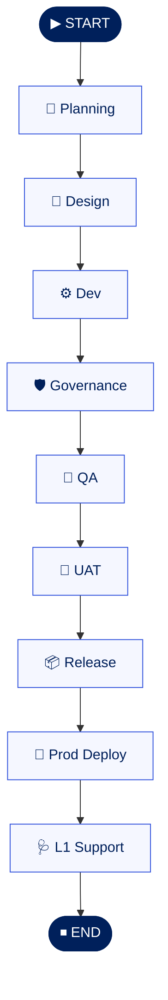

All the *real* complexity — retries, upstream feedback loops, and human escalation — lives **inside
each hop**, and every hop has the **same shape**. So instead of cramming it into one giant graph
(which gets unreadable fast), we define that shape **once** in §2 and then stamp it out per stage in
§2.1.

What each stage's pattern adds on top of the spine:

- **Local retry loop** — a gate can send work back to the *same* agent (`refine`, `fix`) while a
  per-phase retry budget remains.
- **Cross-stage feedback** — failures can bounce *upstream*: a Dev build failure caused by a bad
  schema goes back to **Design**; a governance policy gap goes back to **Planning**; UAT rejection
  can trigger `major rework` at Design.
- **Continuous-improvement loop** — once live, **L1 Support** can raise a `change request` that
  re-enters **Planning**, closing the lifecycle loop.
- **HITL** — when the retry budget is exhausted (or a human decision is mandatory, like UAT), the
  gate escalates to a human who can resume / redirect / abort (§3).
- **Exit criteria** — each gate is a literal exit-criteria check; the graph only reaches `END` when
  the **Steady state?** gate confirms a healthy production system (or a human aborts).

---

## 2. The universal node pattern

Every agent in the graph follows the same **produce → self-check → route** contract. Standardizing
this is what keeps a graph this large maintainable: you implement the pattern once and reuse it.

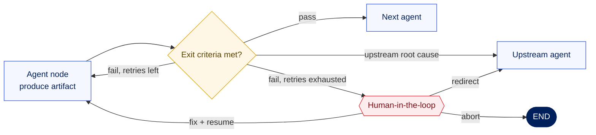

The router function returns one of four outcomes: **advance**, **retry** (same node, decrement
budget), **bounce** (named upstream node), or **escalate** (interrupt for a human). A global
`recursion_limit` on the compiled graph is the final backstop against infinite loops.

### 2.1 The same pattern, every stage

Here is that one pattern stamped out for all nine stages. Every diagram is the *identical* shape —
only the labels and the advance/bounce targets change. Read top-to-bottom; the green node is the
next stage on the spine.

**1 · Planning**
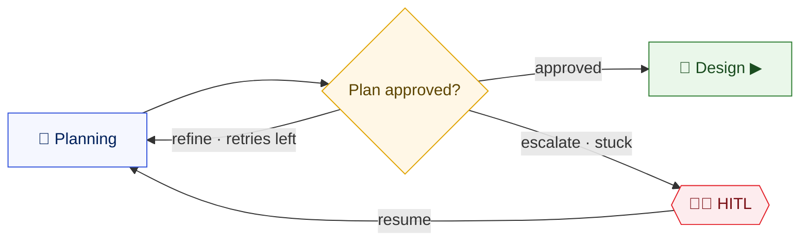

**2 · Design**
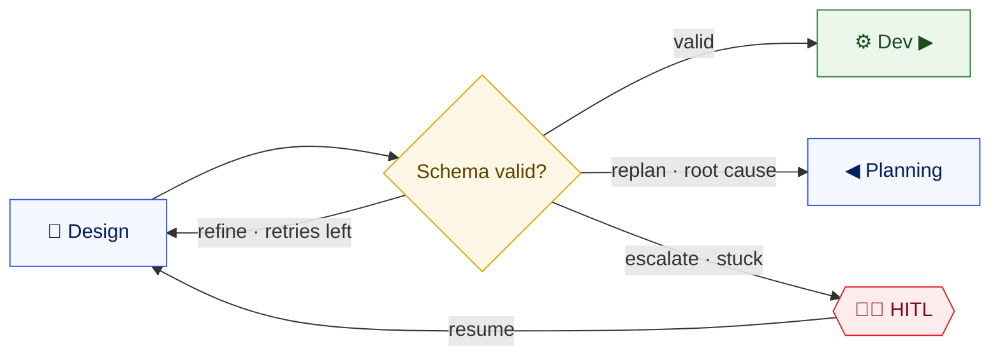

**3 · Dev**
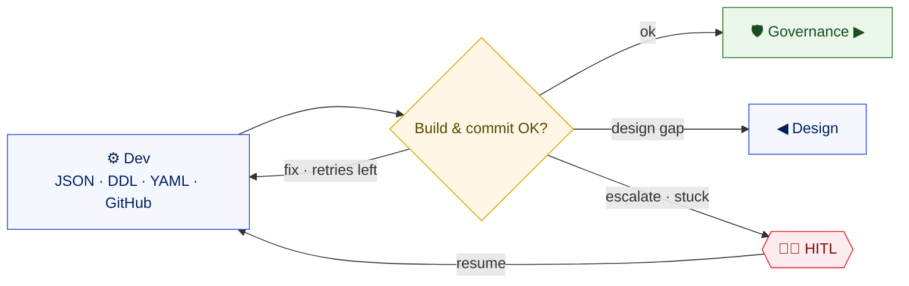

**4 · Governance**
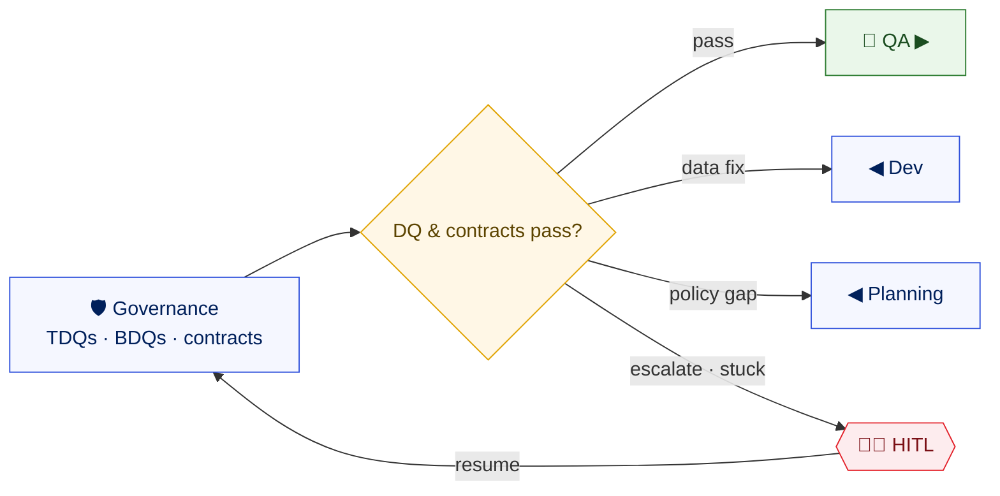

**5 · QA**
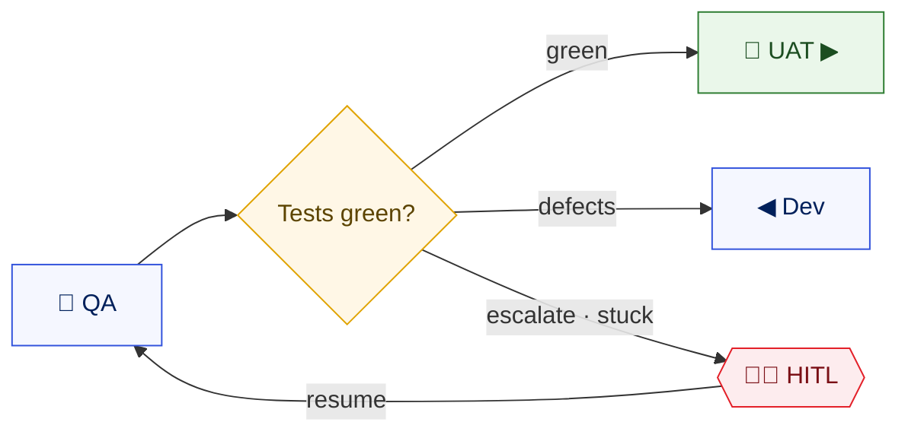

**6 · UAT** — here the gate *is* the human (SME sign-off):
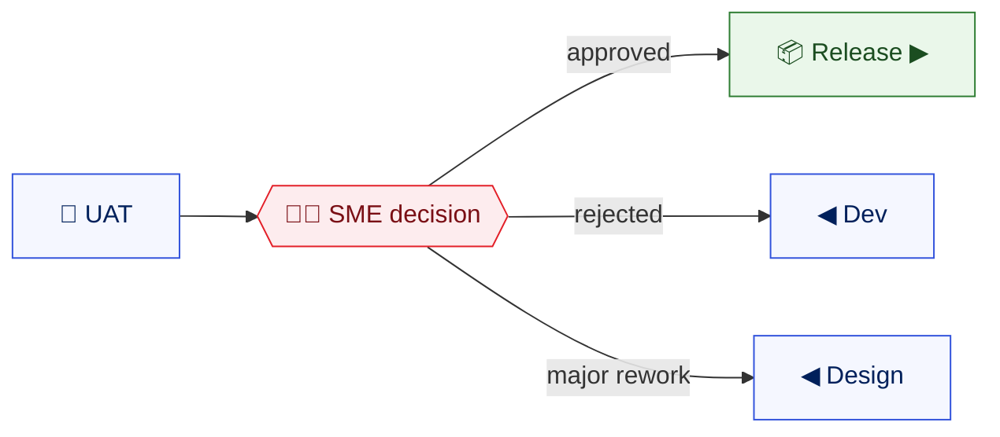

**7 · Release**
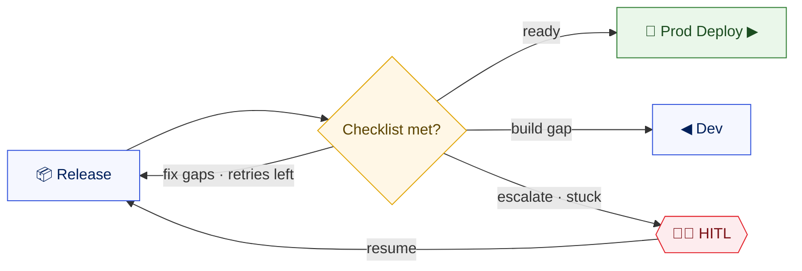

**8 · Prod Deploy**
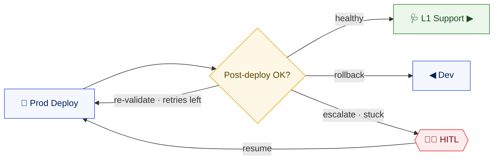

**9 · L1 Support**
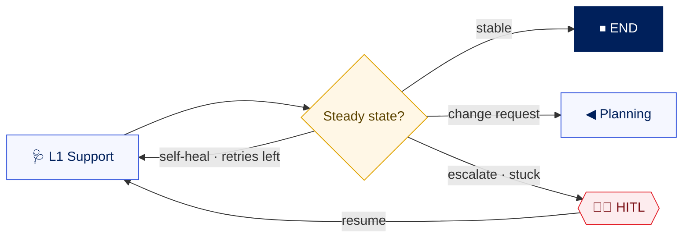

---

## 3. The human-in-the-loop lifecycle

HITL in LangGraph is implemented with `interrupt()` + a **checkpointer**. When an agent (or gate)
calls `interrupt(payload)`, the graph **pauses durably** and surfaces the payload to your app. The run
resumes only when you send a `Command(resume=...)` for that thread — possibly minutes or days later.

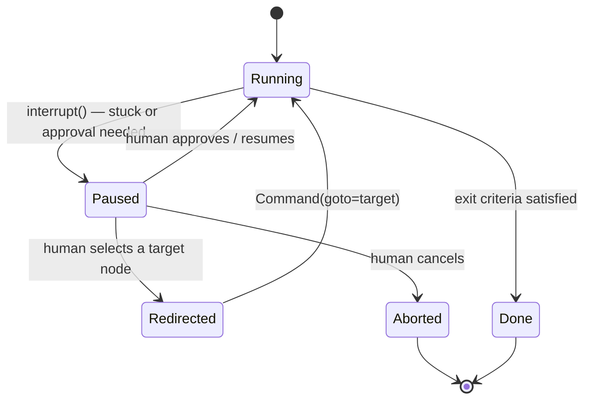

Because the pause is backed by a checkpointer (e.g. Postgres / Lakebase), **state survives process
restarts** — essential for the UAT step, where an SME might approve hours later.

---

## 4. Mapping to LangGraph primitives

| Concept in the diagram | LangGraph primitive |
|------------------------|---------------------|
| Agent node | a node function added with `graph.add_node(name, fn)` |
| Quality gate / loop decision | a **conditional edge** (`add_conditional_edges`) or `Command(goto=...)` returned from the node |
| Per-phase retry budget | a counter in the shared **state** (`TypedDict`), decremented on retry |
| Cross-stage bounce (e.g. `design gap`) | router returns the upstream node name as `goto` |
| Escalate / approval | `interrupt(payload)` from `langgraph.types`, resumed with `Command(resume=...)` |
| Durable pause + resume | a **checkpointer** (`MemorySaver` for dev; Postgres/Lakebase for prod) + a `thread_id` |
| Global infinite-loop guard | `recursion_limit` in the run config (we already set this in `model.py`) |
| Shared artifacts (specs, DDLs, test results) | fields on the state object, not chat messages |

### 4.1 State schema

```python
from typing import Annotated, Literal, TypedDict
from langgraph.graph.message import add_messages

Phase = Literal[
    "planning", "design", "dev", "governance", "qa",
    "uat", "release", "deploy", "l1", "done",
]

MAX_RETRIES = 3

class PipelineState(TypedDict):
    messages: Annotated[list, add_messages]
    phase: Phase
    artifacts: dict          # {"confluence_url":..., "jira":[...], "ddls":[...], ...}
    retries: dict            # {"design": 1, "dev": 0, ...}
    gate_report: dict        # last gate's findings, surfaced to humans
    hitl_decision: str | None  # filled in when a human resumes
```

### 4.2 A node + its gate (the reusable pattern)

```python
from langgraph.types import interrupt, Command

def design_agent(state: PipelineState) -> Command:
    schema = generate_3nf_schema(state["artifacts"])          # do the work
    artifacts = {**state["artifacts"], "schema": schema}
    return Command(update={"artifacts": artifacts, "phase": "design"}, goto="design_gate")

def design_gate(state: PipelineState) -> Command:
    report = validate_schema(state["artifacts"]["schema"])     # exit criteria
    if report.ok:
        return Command(update={"gate_report": report.dict()}, goto="dev_agent")

    tries = state["retries"].get("design", 0)
    if report.root_cause == "requirements":                    # bounce upstream
        return Command(goto="planning_agent")
    if tries < MAX_RETRIES:                                     # local retry loop
        return Command(update={"retries": {**state["retries"], "design": tries + 1}},
                       goto="design_agent")

    # stuck -> hand to a human; graph pauses here until resumed
    decision = interrupt({"phase": "design", "report": report.dict()})
    return Command(goto=decision["goto"])                       # e.g. "design_agent" / "planning_agent" / "__end__"
```

### 4.3 Wiring and compiling

```python
from langgraph.graph import StateGraph, START, END
from langgraph.checkpoint.memory import MemorySaver  # swap for Postgres/Lakebase in prod

g = StateGraph(PipelineState)
for name, fn in {
    "planning_agent": planning_agent, "design_agent": design_agent,
    "dev_agent": dev_agent, "governance_agent": governance_agent,
    "qa_agent": qa_agent, "uat_agent": uat_agent, "release_agent": release_agent,
    "deploy_agent": deploy_agent, "l1_agent": l1_agent,
    # gates
    "design_gate": design_gate,  # ... one gate per agent
}.items():
    g.add_node(name, fn)

g.add_edge(START, "planning_agent")
# Most routing is done via Command(goto=...) returned from nodes, so explicit
# edges are only needed where you prefer add_conditional_edges.

app = g.compile(checkpointer=MemorySaver())

# Run with a durable thread + a global loop guard:
config = {"configurable": {"thread_id": session_id}, "recursion_limit": 80}
for event in app.stream({"messages": [...], "phase": "planning",
                         "artifacts": {}, "retries": {}}, config):
    ...
```

### 4.4 Resuming after a human decision

```python
# When app.stream yields an interrupt, your API surfaces it to the UI.
# After the human responds, resume the SAME thread_id:
app.invoke(Command(resume={"goto": "design_agent"}), config)
```

---

## 5. Exit criteria per stage

The graph is only as good as its gates. Define crisp, machine-checkable exit criteria so the router
isn't guessing.

| Agent | Advances only when… | Bounces to | Mandatory HITL? |
|-------|---------------------|------------|-----------------|
| Planning | Confluence spec written, JIRA epics/stories created & linked | — | optional |
| Design | 3NF schema validates (conceptual/logical/physical consistent, keys resolve) | Planning | optional |
| Dev | DDL/JSON/YAML generated, lints, **commits to GitHub** (CI green) | Design | optional |
| Governance | TDQs/BDQs defined, data contracts validate against schema | Dev / Planning | optional |
| QA | Test cases generated and **all pass** against the build | Dev | optional |
| UAT | **SME explicitly approves** | Dev / Design | **yes** |
| Release | Release checklist 100% satisfied, release doc generated | Dev | optional |
| Prod Deploy | Deploy succeeds **and** post-deploy validation passes | Dev (rollback) | optional |
| L1 Support | Monitors healthy; self-heal resolves known issues | Planning (change request) | on incident |

---

## 6. How this relates to the current agent

- **Today:** `backend/agent/model.py` builds one `create_agent` ReAct node and streams it. Tools come
  from `backend/tools/registry.py`. `recursion_limit` is already wired from `MAX_ITERATIONS`.
- **To extend:** introduce a `PipelineState`, implement each agent as a node (each can *itself* be a
  small ReAct agent reusing today's tools), and replace the single graph with the `StateGraph` above.
- **Reuse what exists:** OBO auth, managed-MCP SQL/Genie tools, skills (`read_skill` + personal
  skills), and MLflow tracing all carry over unchanged — each node simply calls the same tools.
- **New infra you'll want:** a **persistent checkpointer** (Postgres/Lakebase) so HITL pauses survive
  restarts, and an API surface to deliver/resume interrupts (extend `/chat` or add `/resume`).

---

### TL;DR

Model each lifecycle stage as a node, put a **gate with explicit exit criteria** after each one, let
gates **retry locally, bounce upstream, or escalate to a human**, back the whole thing with a
**checkpointer** so HITL pauses are durable, and cap everything with a global `recursion_limit`. The
mermaid in §1 is the contract; §4 is how you build it.
